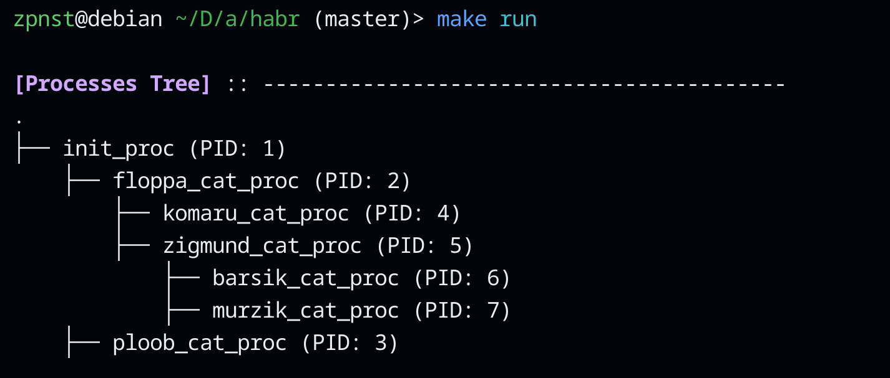

# namesapces-example-for-habr

This example has memory leaks, so it is used only for educational purposes.

Type `make run` and examine the terminal output `<(0_0)>`.

`make run` result:

1) ---

---

2)

3)

4) -

5) -

